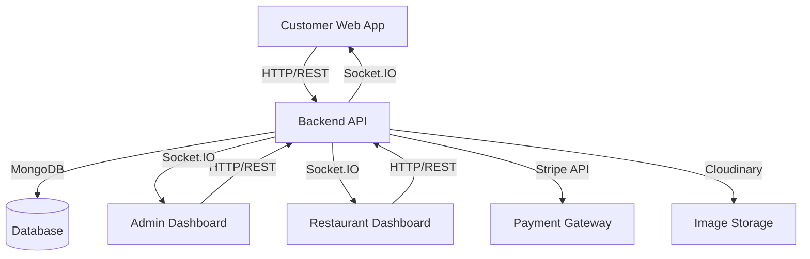
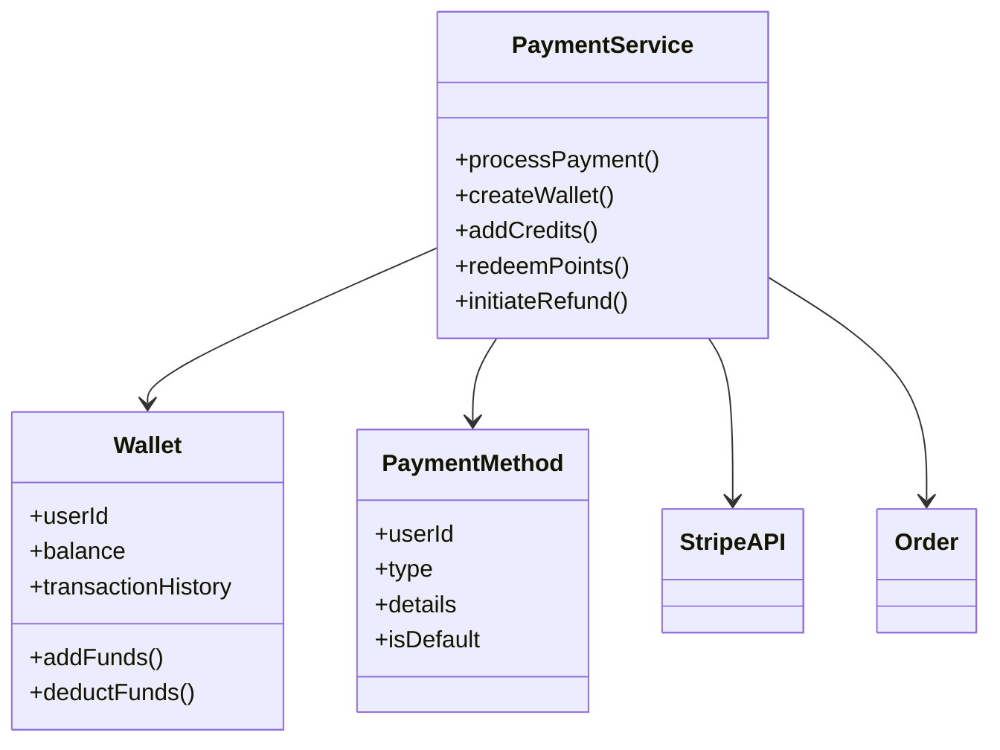
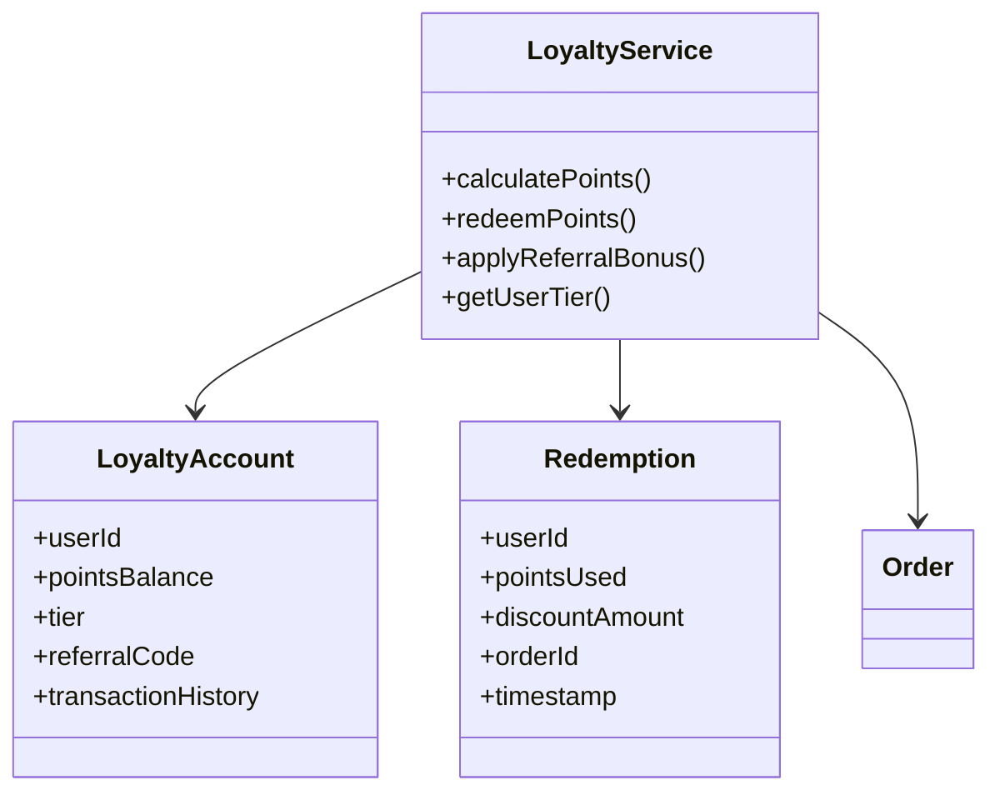
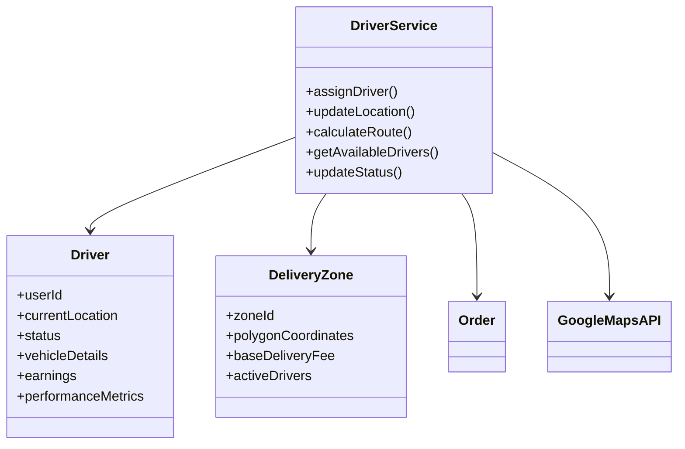
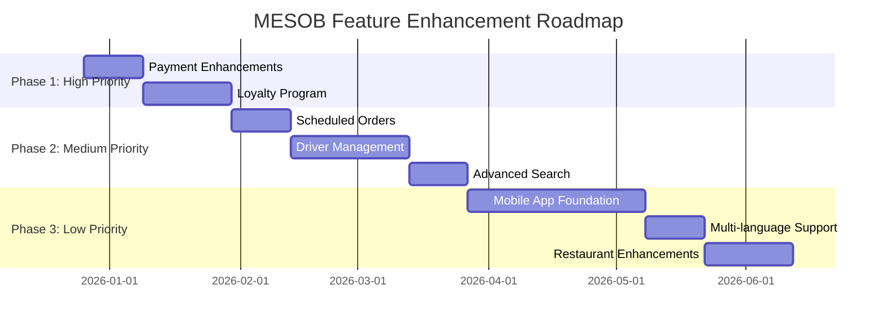

# MESOB Food Ordering Platform - Feature Analysis & Enhancement Plan

## 📊 Current System Overview

The MESOB Food Ordering Platform is a comprehensive enterprise-level system with the following current features:

### ✅ Implemented Features

#### Core Functionality

- ✅ User authentication (JWT-based)
- ✅ Role-based access control (Admin, Restaurant Owner, Customer, Driver)
- ✅ Restaurant management (CRUD operations)
- ✅ Menu management with categories
- ✅ Order placement and processing
- ✅ Real-time order tracking with status history
- ✅ Payment integration (Stripe)
- ✅ Review and rating system
- ✅ Notification system (real-time via Socket.IO)
- ✅ Analytics dashboards (Admin & Restaurant)

#### Advanced Features

- ✅ Order tracking with 7-step status flow
- ✅ Multi-level review system (food, service, delivery)
- ✅ Restaurant response capability
- ✅ Helpful voting on reviews
- ✅ Real-time notifications (11 types)
- ✅ Comprehensive analytics (revenue, orders, ratings)
- ✅ Address management
- ✅ Contactless delivery options
- ✅ Promo code support

### 🔍 Current Architecture Analysis



## 🚀 Missing Features & Enhancement Opportunities

### 1. 💳 Payment System Enhancements

**Current State:**

- Only Stripe card payments and cash on delivery
- Basic payment status tracking

**Missing Features:**

- [ ] Digital wallets (Apple Pay, Google Pay)
- [ ] Wallet/Credits system for stored value
- [ ] Multiple currency support
- [ ] Payment method selection in customer profile
- [ ] Payment failure retry mechanism
- [ ] Refund processing workflow

### 2. 🎁 Loyalty & Rewards Program

**Current State:**

- No loyalty program implemented

**Missing Features:**

- [ ] Points system (earn points on orders)
- [ ] Tier-based rewards (Bronze/Silver/Gold)
- [ ] Referral program with bonuses
- [ ] Points redemption for discounts
- [ ] Loyalty program analytics

### 3. 📅 Scheduled & Recurring Orders

**Current State:**

- Only immediate order placement

**Missing Features:**

- [ ] Schedule orders for future delivery
- [ ] Recurring orders (daily/weekly meal plans)
- [ ] Pre-order for peak hours
- [ ] Order scheduling calendar view

### 4. 🚗 Driver Management System

**Current State:**

- Basic driver assignment field in orders
- No dedicated driver interface

**Missing Features:**

- [ ] Driver dashboard with available orders
- [ ] Driver assignment algorithm (proximity-based)
- [ ] Driver earnings and tips tracking
- [ ] Driver performance metrics
- [ ] Route optimization
- [ ] Delivery zone management

### 5. 📱 Mobile App Features

**Current State:**

- Web applications only

**Missing Features:**

- [ ] Mobile app with offline mode
- [ ] Push notifications
- [ ] Camera integration (QR codes, review photos)
- [ ] Location services (auto-detect address)
- [ ] Biometric authentication

### 6. 🌍 Multi-language & Localization

**Current State:**

- English only interface

**Missing Features:**

- [ ] i18n implementation
- [ ] Multiple language support
- [ ] RTL support for Arabic/Hebrew
- [ ] Localized content and menus

### 7. 🛒 Advanced Search & Discovery

**Current State:**

- Basic search by restaurant name
- Simple filtering by cuisine

**Missing Features:**

- [ ] Multi-criteria search (dish name, ingredients, price range)
- [ ] Advanced filters (dietary preferences, delivery time, ratings)
- [ ] Map view with restaurant locations
- [ ] Personalized recommendations
- [ ] "Customers also ordered" suggestions

### 8. 📊 Enhanced Analytics

**Current State:**

- Basic revenue and order analytics
- Admin and restaurant dashboards

**Missing Features:**

- [ ] Customer segmentation analytics
- [ ] Churn prediction
- [ ] Menu performance heatmaps
- [ ] Delivery time optimization analytics
- [ ] Exportable reports (PDF, Excel)

### 9. 🔒 Security Enhancements

**Current State:**

- JWT authentication
- Basic RBAC

**Missing Features:**

- [ ] Multi-factor authentication (SMS/Email OTP)
- [ ] Social login (Google, Facebook, Apple)
- [ ] Advanced RBAC with granular permissions
- [ ] Audit logging
- [ ] GDPR compliance features

### 10. 🍽️ Restaurant Features

**Current State:**

- Basic restaurant management
- Menu management

**Missing Features:**

- [ ] Bulk menu upload (CSV/Excel)
- [ ] Menu item variations and add-ons
- [ ] Table reservation system
- [ ] Kitchen display system
- [ ] Printer integration for orders
- [ ] Inventory management

## 🎯 Feature Prioritization Matrix

```
| Priority | Feature Category | Business Impact | Implementation Complexity |
|----------|------------------|-----------------|--------------------------|
| 🔴 High  | Payment Enhancements | ★★★★★ | ★★☆☆☆ |
| 🔴 High  | Loyalty Program | ★★★★★ | ★★★☆☆ |
| 🟡 Medium | Scheduled Orders | ★★★★☆ | ★★☆☆☆ |
| 🟡 Medium | Driver Management | ★★★★☆ | ★★★★☆ |
| 🟡 Medium | Advanced Search | ★★★☆☆ | ★★☆☆☆ |
| 🟢 Low   | Mobile App | ★★★★★ | ★★★★★ |
| 🟢 Low   | Multi-language | ★★★☆☆ | ★★☆☆☆ |
| 🟢 Low   | Restaurant Features | ★★★☆☆ | ★★★☆☆ |
| 🟢 Low   | Security Enhancements | ★★★★☆ | ★★★☆☆ |
| 🟢 Low   | Enhanced Analytics | ★★★☆☆ | ★★★☆☆ |
```

## 📋 Recommended Implementation Plan

### Phase 1: High Priority Features (3-4 weeks)

1. **Payment System Enhancements**
   - Add digital wallet support
   - Implement wallet/credits system
   - Add payment method management

2. **Loyalty Program**
   - Points earning system
   - Basic redemption functionality
   - Referral program

### Phase 2: Medium Priority Features (4-6 weeks)

3. **Scheduled Orders**
   - Future order scheduling
   - Recurring order support
   - Calendar integration

4. **Driver Management**
   - Driver dashboard
   - Assignment algorithm
   - Basic route optimization

5. **Advanced Search**
   - Multi-criteria search
   - Advanced filters
   - Map view integration

### Phase 3: Low Priority Features (6-8 weeks)

6. **Mobile App Foundation**
   - React Native setup
   - Core functionality port
   - Push notifications

7. **Multi-language Support**
   - i18n implementation
   - Language switcher
   - Localized content

8. **Restaurant Enhancements**
   - Bulk menu upload
   - Table reservations
   - Kitchen display system

## 🔧 Technical Implementation Recommendations

### 1. Payment System Architecture



### 2. Loyalty Program Architecture



### 3. Driver Management Architecture



## 📈 Business Impact Analysis

### Revenue Growth Opportunities

1. **Loyalty Program**: Increase customer retention by 20-30%
2. **Scheduled Orders**: Capture breakfast and meal prep market
3. **Multiple Payment Methods**: Reduce cart abandonment by 15%
4. **Driver Management**: Improve delivery efficiency and reduce costs

### Customer Experience Improvements

1. **Advanced Search**: Faster discovery of desired food options
2. **Mobile App**: Convenient on-the-go ordering
3. **Multi-language**: Broader market reach
4. **Personalized Recommendations**: Increased order frequency

### Operational Efficiency Gains

1. **Driver Route Optimization**: 15-20% reduction in delivery times
2. **Kitchen Display System**: Faster order processing
3. **Inventory Management**: Reduced food waste
4. **Analytics Enhancements**: Data-driven decision making

## 🚀 Implementation Roadmap



## 🎯 Key Recommendations

1. **Start with Payment and Loyalty**: These have the highest business impact with moderate implementation complexity
2. **Leverage Existing Architecture**: Build on the current solid foundation rather than rebuilding
3. **Phase Mobile Development**: Given its high complexity, consider a progressive web app first
4. **Focus on Data**: Enhance analytics capabilities to drive business decisions
5. **Prioritize Customer Retention**: Loyalty programs and personalized experiences will drive repeat business

## 📝 Next Steps

1. [ ] Finalize feature prioritization with stakeholders
2. [ ] Create detailed technical specifications for Phase 1 features
3. [ ] Update database schema for new models
4. [ ] Implement API endpoints for new functionality
5. [ ] Develop frontend components and integrate with backend
6. [ ] Comprehensive testing and quality assurance

This analysis provides a comprehensive roadmap for enhancing the MESOB Food Ordering Platform with enterprise-level features that will significantly improve business outcomes and customer satisfaction.
