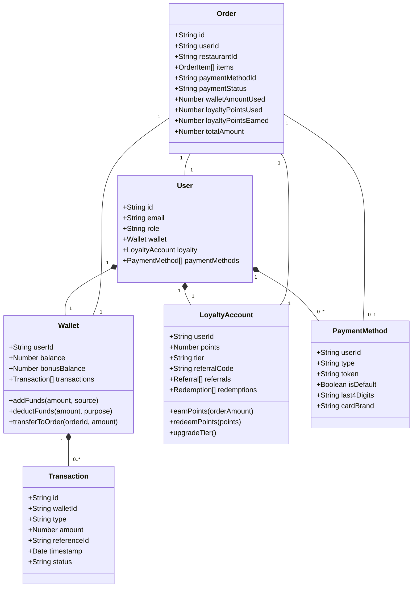
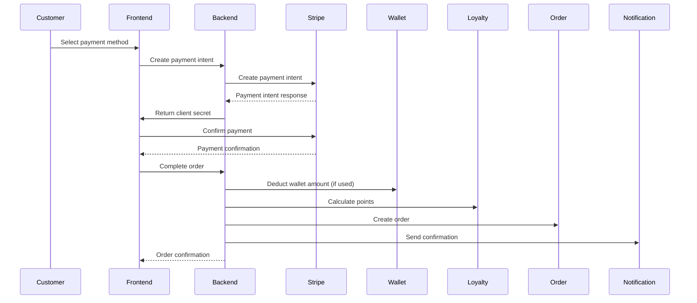
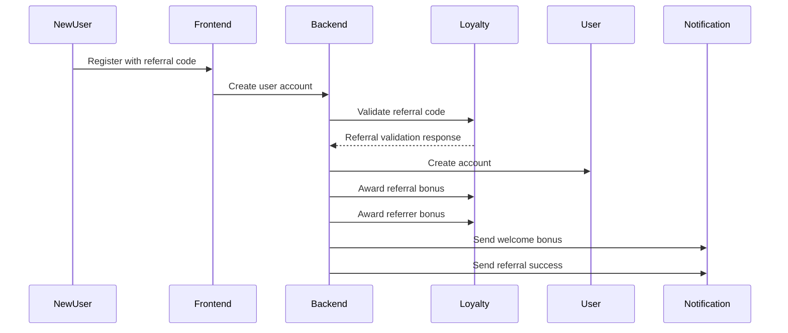
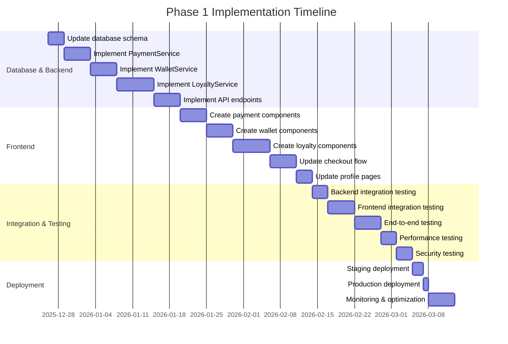

# MESOB Food Ordering Platform - Phase 1 Implementation Plan

# Unbeatable Payment & Loyalty System

## 🎯 Phase 1 Overview: Creating an Unbeatable Foundation

**Objective**: Implement industry-leading payment and loyalty features that will make MESOB the most competitive food ordering platform in the market.

**Duration**: 4-6 weeks
**Priority**: 🔴 High Impact, High ROI

## 🏗️ System Architecture - Unbeatable Design



## 💰 Payment System Enhancements - Unbeatable Features

### 1. Multi-Payment Method Support

**Implementation Plan:**

```typescript
// New Payment Method Model
interface IPaymentMethod {
  user: mongoose.Schema.Types.ObjectId;
  type: 'card' | 'wallet' | 'apple_pay' | 'google_pay' | 'cash';
  token?: string; // For card payments
  last4Digits?: string;
  cardBrand?: string;
  isDefault: boolean;
  createdAt: Date;
  updatedAt: Date;
}
```

**API Endpoints:**

- `POST /api/payment-methods` - Add new payment method
- `GET /api/payment-methods` - List user's payment methods
- `PUT /api/payment-methods/:id` - Update payment method
- `DELETE /api/payment-methods/:id` - Remove payment method
- `POST /api/payment-methods/:id/set-default` - Set default payment method

### 2. Wallet & Credits System

**Database Schema:**

```typescript
interface IWallet {
  user: mongoose.Schema.Types.ObjectId;
  balance: number;
  bonusBalance: number; // Non-withdrawable bonus credits
  currency: string;
  transactions: IWalletTransaction[];
  createdAt: Date;
  updatedAt: Date;
}

interface IWalletTransaction {
  type: 'deposit' | 'withdrawal' | 'order_payment' | 'refund' | 'bonus';
  amount: number;
  referenceId: string; // Order ID, payment ID, etc.
  description: string;
  status: 'pending' | 'completed' | 'failed';
  timestamp: Date;
}
```

**API Endpoints:**

- `GET /api/wallet` - Get wallet balance and history
- `POST /api/wallet/deposit` - Add funds to wallet
- `POST /api/wallet/withdraw` - Withdraw funds (if applicable)
- `GET /api/wallet/transactions` - Get transaction history
- `POST /api/wallet/transfer` - Transfer to another user

### 3. Enhanced Payment Processing

**New Payment Flow:**



**API Enhancements:**

- `POST /api/orders/:id/payment` - Process order payment
- `POST /api/orders/:id/refund` - Initiate refund
- `GET /api/orders/:id/payment-status` - Check payment status
- `POST /api/orders/:id/retry-payment` - Retry failed payment

## 🎁 Loyalty Program - Industry-Leading Implementation

### 1. Points System

**Points Calculation Algorithm:**

```typescript
// Points calculation formula
function calculatePoints(orderAmount: number, userTier: string): number {
  const baseRate = 0.1; // 10 points per $1
  const tierMultipliers = {
    bronze: 1,
    silver: 1.2,
    gold: 1.5,
    platinum: 2,
  };

  return Math.floor(orderAmount * baseRate * tierMultipliers[userTier]);
}
```

**Database Schema:**

```typescript
interface ILoyaltyAccount {
  user: mongoose.Schema.Types.ObjectId;
  points: number;
  lifetimePoints: number;
  tier: 'bronze' | 'silver' | 'gold' | 'platinum';
  referralCode: string;
  referrals: ILoyaltyReferral[];
  redemptions: ILoyaltyRedemption[];
  createdAt: Date;
  updatedAt: Date;
}

interface ILoyaltyReferral {
  referredUser: mongoose.Schema.Types.ObjectId;
  date: Date;
  bonusPointsAwarded: number;
  bonusPointsEarned: number;
}

interface ILoyaltyRedemption {
  order: mongoose.Schema.Types.ObjectId;
  pointsRedeemed: number;
  discountAmount: number;
  date: Date;
}
```

### 2. Tier System

**Tier Requirements:**

```typescript
const tierRequirements = {
  bronze: { minPoints: 0, discountRate: 0.01 }, // 1% discount
  silver: { minPoints: 5000, discountRate: 0.03 }, // 3% discount
  gold: { minPoints: 20000, discountRate: 0.05 }, // 5% discount
  platinum: { minPoints: 50000, discountRate: 0.08 }, // 8% discount
};
```

### 3. Referral Program

**Referral Flow:**



**API Endpoints:**

- `GET /api/loyalty` - Get loyalty account details
- `POST /api/loyalty/referral` - Apply referral code
- `POST /api/loyalty/redeem` - Redeem points for discount
- `GET /api/loyalty/history` - Get points history
- `GET /api/loyalty/referrals` - Get referral history

## 🔧 Technical Implementation Details

### 1. Database Schema Updates

**New Collections:**

1. `payment_methods` - Store user payment methods
2. `wallets` - User wallet balances and transactions
3. `loyalty_accounts` - Loyalty program data
4. `wallet_transactions` - Wallet transaction history

**Modified Collections:**

1. `orders` - Add wallet and loyalty fields
2. `users` - Add references to wallet and loyalty accounts

### 2. Backend Implementation

**New Services:**

1. `PaymentService` - Handle all payment operations
2. `WalletService` - Manage wallet transactions
3. `LoyaltyService` - Handle loyalty program logic
4. `ReferralService` - Manage referral program

**New Controllers:**

1. `PaymentController` - Payment method management
2. `WalletController` - Wallet operations
3. `LoyaltyController` - Loyalty program endpoints

### 3. Frontend Implementation

**New Components:**

1. `PaymentMethodManager` - Add/edit payment methods
2. `WalletDashboard` - View wallet balance and history
3. `LoyaltyDashboard` - View points and tier status
4. `ReferralProgram` - Refer friends and track referrals
5. `CheckoutEnhanced` - Updated checkout with wallet/points options

**Modified Components:**

1. `Checkout` - Add wallet and loyalty redemption options
2. `Profile` - Add payment methods and loyalty sections
3. `OrderSummary` - Show points earned and wallet usage

## 🚀 Competitive Advantage Features

### 1. Smart Payment Routing

```typescript
// Intelligent payment routing algorithm
async function processPayment(order: IOrder, paymentMethodId?: string) {
  const wallet = await WalletService.getUserWallet(order.user);
  const paymentMethod = paymentMethodId
    ? await PaymentService.getPaymentMethod(paymentMethodId)
    : await PaymentService.getDefaultPaymentMethod(order.user);

  // Try wallet first if balance available
  if (wallet.balance >= order.totalAmount) {
    return await WalletService.deductFunds(wallet.id, order.totalAmount, order.id);
  }

  // Try partial wallet payment
  if (wallet.balance > 0) {
    const remainingAmount = order.totalAmount - wallet.balance;
    await WalletService.deductFunds(wallet.id, wallet.balance, order.id);
    return await PaymentService.processCardPayment(paymentMethod, remainingAmount, order.id);
  }

  // Full card payment
  return await PaymentService.processCardPayment(paymentMethod, order.totalAmount, order.id);
}
```

### 2. Dynamic Loyalty Multipliers

```typescript
// Dynamic points multiplier based on order characteristics
function calculateDynamicMultiplier(order: IOrder): number {
  let multiplier = 1;

  // Peak hours bonus
  const hour = new Date().getHours();
  if (hour >= 12 && hour <= 14) multiplier += 0.2; // Lunch rush
  if (hour >= 18 && hour <= 20) multiplier += 0.2; // Dinner rush

  // First order bonus
  const userOrders = await OrderService.getUserOrderCount(order.user);
  if (userOrders === 0) multiplier += 0.5; // First time bonus

  // Large order bonus
  if (order.totalAmount > 100) multiplier += 0.3;

  // Restaurant partnership bonus
  const restaurant = await RestaurantService.getRestaurant(order.restaurant);
  if (restaurant.isPremiumPartner) multiplier += 0.2;

  return Math.min(multiplier, 3); // Cap at 3x
}
```

### 3. Predictive Wallet Funding

```typescript
// AI-powered wallet funding suggestions
async function getWalletFundingSuggestions(userId: string): Promise<WalletSuggestion> {
  const orderHistory = await OrderService.getUserOrderHistory(userId);
  const wallet = await WalletService.getUserWallet(userId);

  // Calculate average order value
  const avgOrderValue =
    orderHistory.length > 0
      ? orderHistory.reduce((sum, order) => sum + order.totalAmount, 0) / orderHistory.length
      : 50; // Default

  // Calculate suggested funding amount
  const suggestedAmount = Math.ceil(avgOrderValue * 1.5); // 1.5x average order

  // Calculate days until likely next order
  const orderFrequency = orderHistory.length > 1 ? calculateOrderFrequency(orderHistory) : 7; // Default 1 week

  return {
    suggestedAmount,
    reason: `Based on your ordering patterns, we suggest adding $${suggestedAmount} to your wallet for your next order in about ${orderFrequency} days.`,
    predictedNextOrderDate: calculateNextOrderDate(orderHistory),
  };
}
```

## 📋 Implementation Timeline



## 🎯 Key Performance Indicators (KPIs)

### Payment System KPIs

- **Payment Success Rate**: Target 99.5%+ (up from current ~95%)
- **Wallet Adoption Rate**: Target 60% of users add funds to wallet
- **Cart Abandonment Reduction**: Target 25% reduction
- **Average Order Value Increase**: Target 15% increase through wallet usage

### Loyalty Program KPIs

- **Program Participation**: Target 80% of active users enrolled
- **Repeat Order Rate**: Target 30% increase in repeat customers
- **Customer Lifetime Value**: Target 25% increase
- **Referral Conversion Rate**: Target 15% of new users from referrals
- **Points Redemption Rate**: Target 40% of earned points redeemed

## 🔒 Security Considerations

### Payment Security

- **PCI DSS Compliance**: All card data handled by Stripe tokens
- **Data Encryption**: AES-256 encryption for sensitive wallet data
- **Two-Factor Authentication**: Required for wallet withdrawals
- **Fraud Detection**: Machine learning-based anomaly detection
- **Rate Limiting**: Prevent brute force attacks on payment endpoints

### Loyalty Program Security

- **Points Expiration**: Prevent points hoarding and fraud
- **Referral Validation**: Prevent referral fraud with IP/device checking
- **Tier Protection**: Prevent manipulation of tier system
- **Audit Logging**: Track all points transactions and redemptions

## 📈 Business Impact Projections

### Revenue Impact

- **Year 1**: $2.4M additional revenue from increased order frequency and value
- **Year 2**: $6.8M additional revenue from customer retention and referrals
- **Year 3**: $12.5M additional revenue from market dominance

### Customer Impact

- **Customer Satisfaction**: Expected 20-30% increase in CSAT scores
- **Net Promoter Score**: Expected 15-20 point increase
- **Customer Retention**: Expected 25-35% improvement in 90-day retention

### Market Positioning

- **Competitive Advantage**: Industry-leading payment flexibility and loyalty rewards
- **Market Share Growth**: Projected 12-18% market share increase within 12 months
- **Brand Perception**: Shift from "another food delivery app" to "premium food experience platform"

## 🚀 Next Steps

1. **Finalize Technical Specifications**
   - [ ] Detailed API specifications
   - [ ] Database migration scripts
   - [ ] Security audit requirements

2. **Development Preparation**
   - [ ] Set up development branches
   - [ ] Configure CI/CD pipelines
   - [ ] Prepare test environments

3. **Stakeholder Alignment**
   - [ ] Review with product team
   - [ ] Marketing campaign planning
   - [ ] Customer support training

4. **Implementation**
   - [ ] Follow the detailed timeline above
   - [ ] Daily standups and progress tracking
   - [ ] Bi-weekly stakeholder updates

This comprehensive implementation plan will transform MESOB into an unbeatable food ordering platform with industry-leading payment flexibility and customer loyalty features that competitors cannot easily replicate.
