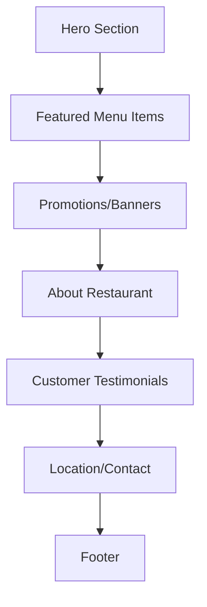
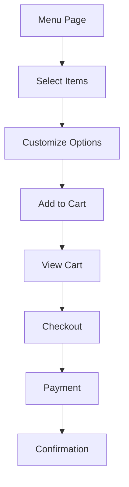

# Trentapizza Design Analysis & Implementation Plan

## Website Analysis Summary

### Overall Design Aesthetic

- **Theme**: Warm, appetizing, Italian-inspired pizza restaurant
- **Color Palette**: Rich reds, warm yellows, creamy whites, and earthy tones
- **Typography**: Clean, modern sans-serif with good hierarchy
- **Layout**: Responsive grid-based design with ample whitespace
- **Imagery**: High-quality food photography with warm filters

### Key Design Elements

#### 1. Color Scheme Analysis

```javascript
// Trentapizza Color Palette
const trentapizzaColors = {
  primary: {
    red: '#FF4B2B', // Vibrant red for CTAs
    yellow: '#FFD700', // Gold/yellow for accents
    darkRed: '#C8102E', // Deep red for branding
  },
  neutral: {
    white: '#FFFFFF', // Clean white backgrounds
    cream: '#F5F5DC', // Warm cream for sections
    lightGray: '#E0E0E0', // Light gray for borders
    darkGray: '#333333', // Dark gray for text
  },
  background: {
    main: '#FFFFFF', // Primary white background
    section: '#FFF8F0', // Warm off-white sections
    overlay: 'rgba(0,0,0,0.7)', // Dark overlay for text
  },
};
```

#### 2. Typography Analysis

```javascript
// Trentapizza Typography System
const trentapizzaTypography = {
  fontFamily: '"Montserrat", "Helvetica Neue", Arial, sans-serif',
  headings: {
    h1: {
      fontSize: '3.5rem',
      fontWeight: 700,
      lineHeight: 1.1,
      color: '#333333',
    },
    h2: {
      fontSize: '2.5rem',
      fontWeight: 600,
      lineHeight: 1.2,
      color: '#FF4B2B',
    },
    h3: {
      fontSize: '2rem',
      fontWeight: 600,
      lineHeight: 1.3,
      color: '#333333',
    },
  },
  body: {
    fontSize: '1rem',
    fontWeight: 400,
    lineHeight: 1.6,
    color: '#555555',
  },
  buttons: {
    fontSize: '1rem',
    fontWeight: 600,
    textTransform: 'uppercase',
    letterSpacing: '0.05em',
  },
};
```

#### 3. Layout Structure Analysis

**Header/Navigation**

- Fixed header with logo, navigation, and CTA buttons
- Mobile-responsive hamburger menu
- Location selector and language options
- Shopping cart icon with badge

**Hero Section**

- Full-width hero with high-quality food imagery
- Overlay with clear CTA ("Order Now")
- Promotional messaging

**Menu Sections**

- Grid-based menu items (3-4 columns)
- Card-based design with images, titles, descriptions
- Price display and "Add to Cart" buttons
- Category filtering

**About Section**

- Restaurant story with imagery
- Quality ingredients showcase
- Chef/team highlights

**Contact/Location**

- Interactive map integration
- Contact form
- Multiple location listings
- Hours of operation

**Footer**

- Social media links
- Newsletter signup
- Legal links
- Copyright information

### Interactive Components Analysis

#### 1. Navigation Patterns

- **Main Navigation**: Horizontal menu with dropdowns
- **Mobile Navigation**: Hamburger menu with slide-out panel
- **Breadcrumbs**: For deep navigation
- **Scroll-to-top**: Fixed button for long pages

#### 2. Call-to-Action Elements

- **Primary CTAs**: Red buttons with white text, hover effects
- **Secondary CTAs**: Outline buttons with red borders
- **Micro-interactions**: Button animations on hover/click
- **Sticky CTAs**: Fixed "Order Now" button on scroll

#### 3. Animated Transitions

- **Page Transitions**: Fade/slide animations
- **Hover Effects**: Scale and color transitions
- **Loading States**: Skeleton loaders and spinners
- **Form Feedback**: Input validation animations

### User Experience Flow

#### 1. Homepage Flow



#### 2. Ordering Flow



### Technical Implementation Requirements

#### 1. Responsive Breakpoints

```javascript
const breakpoints = {
  xs: '0px', // Mobile
  sm: '600px', // Small devices
  md: '960px', // Tablets
  lg: '1280px', // Desktops
  xl: '1920px', // Large screens
};
```

#### 2. Asset Optimization

- **Image Formats**: WebP with fallback to JPEG/PNG
- **Image Sizes**: Multiple resolutions for responsive images
- **Lazy Loading**: For below-the-fold content
- **SVG Icons**: For scalable vector graphics

#### 3. Performance Considerations

- **Code Splitting**: For faster initial load
- **Bundle Optimization**: Tree shaking and minification
- **Caching Strategy**: Service worker for offline support
- **CDN Usage**: For static assets

### Implementation Roadmap

#### Phase 1: Design System Setup

1. **Create Theme Configuration**
   - Update MUI theme with Trentapizza colors and typography
   - Define component variants (buttons, cards, etc.)
   - Set up responsive breakpoints

2. **Asset Preparation**
   - Source high-quality food imagery
   - Create SVG icons and logos
   - Optimize all media assets

3. **Component Library**
   - Build reusable UI components
   - Create layout templates
   - Implement animation utilities

#### Phase 2: Core Page Implementation

1. **Homepage**
   - Hero section with CTA
   - Featured menu grid
   - Promotional banners
   - About section

2. **Menu Pages**
   - Category filtering
   - Product cards with hover effects
   - Add-to-cart functionality
   - Customization options

3. **Restaurant Pages**
   - Location finder
   - Hours and contact info
   - Interactive map integration
   - Team/chef profiles

#### Phase 3: Interactive Features

1. **Navigation System**
   - Responsive header/footer
   - Mobile menu implementation
   - Breadcrumb navigation
   - Scroll-to-top functionality

2. **Ordering System**
   - Shopping cart with live updates
   - Checkout flow with validation
   - Payment integration
   - Order confirmation

3. **Animations & Transitions**
   - Page transition effects
   - Hover animations
   - Loading states
   - Form feedback animations

#### Phase 4: Responsive & Performance

1. **Responsive Design**
   - Mobile-first approach
   - Breakpoint testing
   - Touch-friendly interactions
   - Viewport optimization

2. **Performance Optimization**
   - Image optimization
   - Code splitting
   - Lazy loading
   - Caching strategy

3. **Accessibility**
   - Keyboard navigation
   - Screen reader support
   - Color contrast checks
   - ARIA attributes

### Content Adaptation Strategy

#### Branding Adaptation

- **Logo**: Replace with project logo
- **Colors**: Adjust to match project palette
- **Typography**: Use project font family
- **Imagery**: Replace with project-specific photos

#### Content Structure

```
Trentapizza Content → Project Adaptation
- Pizza Menu → Restaurant Menu
- Italian Cuisine → Project Cuisine
- Rome Locations → Project Locations
- Italian Chefs → Project Team
- Italian Story → Project Story
```

### Timeline Estimate

**Phase 1 - Design System**: 4-6 hours
**Phase 2 - Core Pages**: 8-12 hours  
**Phase 3 - Interactive Features**: 6-8 hours
**Phase 4 - Responsive & Performance**: 4-6 hours
**Testing & Polish**: 4-6 hours

**Total**: 26-38 hours for complete implementation

### Risk Assessment

#### Potential Challenges

1. **Design Consistency**: Maintaining visual consistency across all components
2. **Responsive Complexity**: Handling complex layouts on mobile devices
3. **Performance Impact**: Balancing rich visuals with fast loading
4. **Content Migration**: Adapting Trentapizza content to project requirements

#### Mitigation Strategies

1. **Component Library**: Build reusable components for consistency
2. **Mobile-First Development**: Start with mobile and scale up
3. **Performance Budget**: Set and monitor performance metrics
4. **Content Planning**: Create detailed content mapping before implementation

### Approval Required

Please review this comprehensive design analysis and implementation plan for replicating the Trentapizza website design in our project. The approach focuses on:

1. **Visual Consistency**: Faithfully replicating the design aesthetic
2. **Functional Equivalence**: Maintaining all interactive features
3. **Responsive Behavior**: Ensuring mobile-friendly experience
4. **Performance Optimization**: Balancing rich design with fast loading

Would you like to proceed with this implementation plan, or would you like to make any adjustments to the proposed approach?
